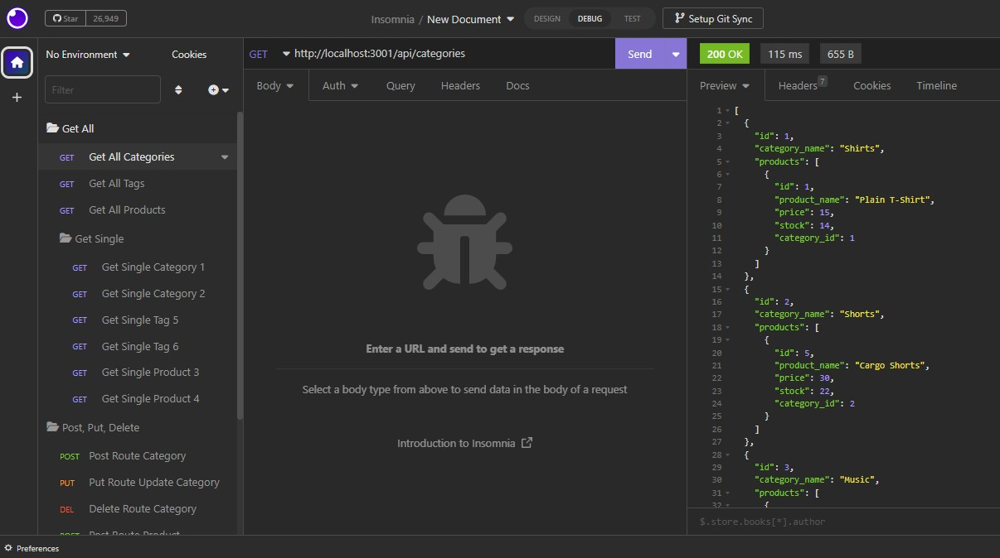
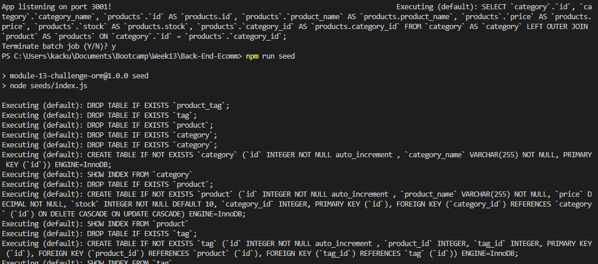

# Back-end-Ecomm

## Action Needed
 Create an application that allows the user to create, save, and delete notes. The application should save the notes even after exiting. The notes will need to be deleted in order to be removed from the database. Express node was used on the backend to save and retrieve the notes which were stored in a JSON file. 

## Actions Taken
* Used Express.JS back end to save and retrieve note data from a JSON file.
* Created API routing files to request and send responses from the server. 
* Created a server file set for the Express back end to handle data parsing and to listen to inputs. 
* Used Insomnia to connect with local host 
* Completed the bonus section and added a delete function so the user can delete notes. 

## Screen Shot
 
 
 

## Links
* Live URL: 
https://drive.google.com/file/d/1L25ntcxh0R9KGtHlzQ-Ssb-4SffGfoln/view

* Github Link:
https://github.com/LondaNH/Back-End-Ecomm

